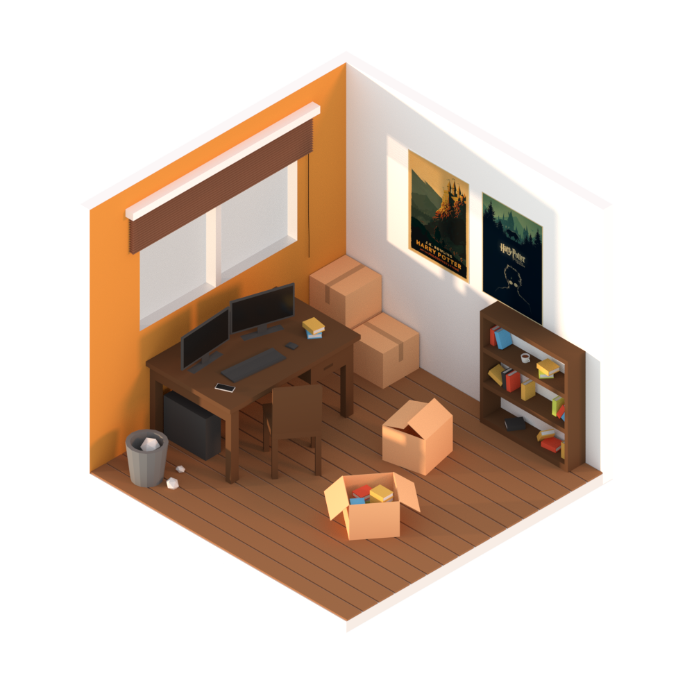

For anyone that does not know, I have had a deeply vested interested in 3D modelling and animation. From my time in university, it's an interest I picked up and loved to play around with. I invested a lot of time in developing my skills only to realize I didn't really have that much skill in the way of artistry... which was a bummer, to say the least.

I worked on tiny projects and often utilized the machines at school to split rendering time between as many machines as possible. It was a fun little interest whilst it lasted. 

I picked up Blender 3D again --Blender being the 3D software I had learnt and familiarized myself with throughout this... "phase"-- last year, and begun working on low-poly isomorphic pieces. 

Here's what came of it:

### Project 00

### Project 01
