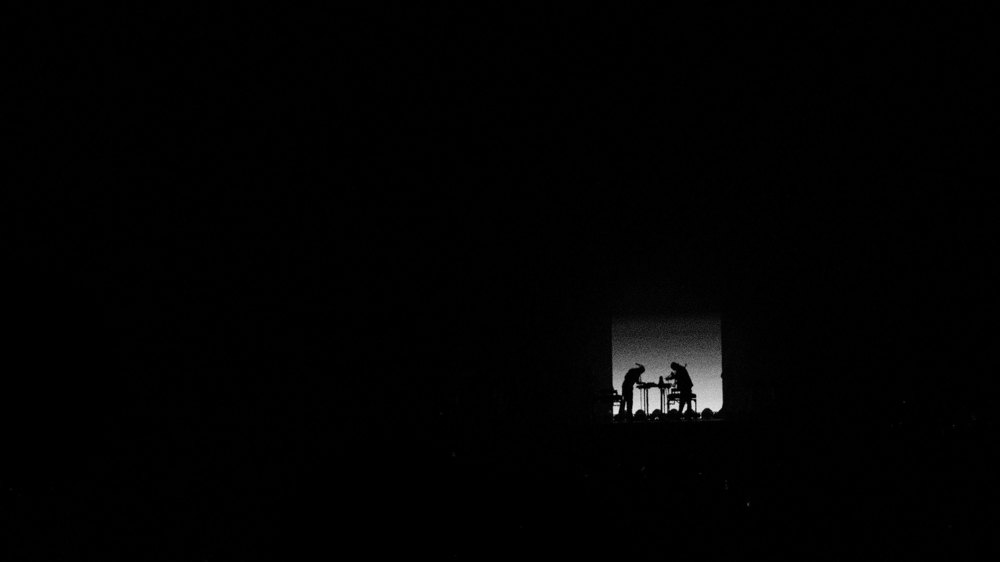
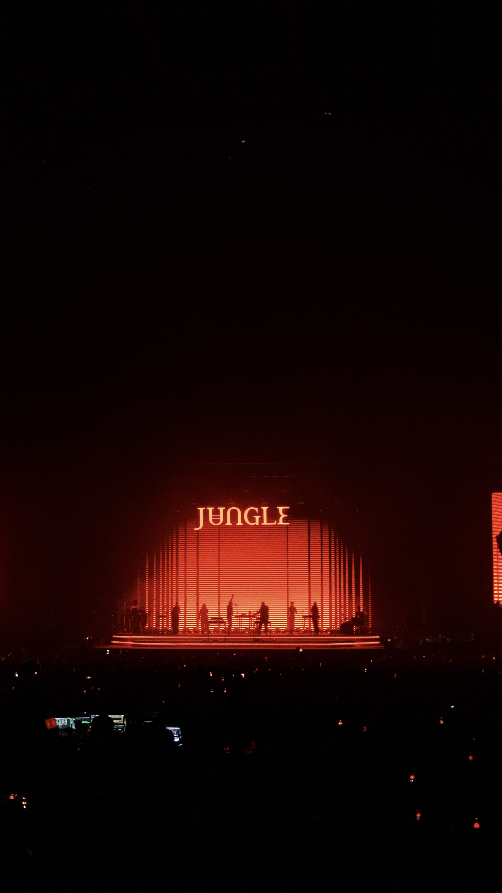
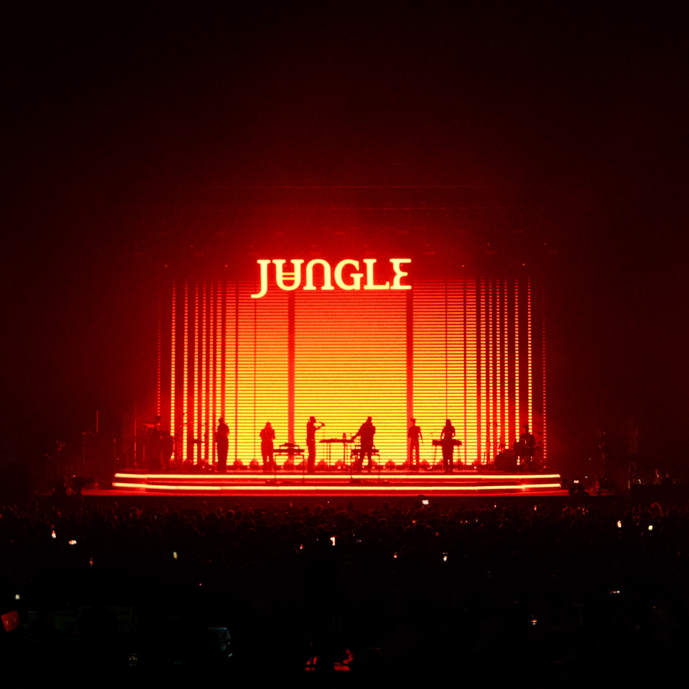

One of the reasons I moved to London was because of the concerts. The shows of music and the people that vibe to them. 
It's an experience I always loved in Accra, and it's something I always wanted to explore more of once I had the chance.
And I'm glad that I did.

Jungle at the O2 was a solid 8.5 to 9 out of 10 for me. 
And it's missing 1 point because I failed to secure standing tickets in time (it's hard to do a little shimmy when you're trapped betwixt two chairs).

They're one of the bands that sounds phenomenal both in person and through your Spotify, or radio, or listening device. Quick aside, 
phones used to have radios, and you could literally tune into FM/AM channels, and now we (or at least Spotify) refer to radios as playlists of similar songs. 

And they're phenomenal because they're one of the bands that sounds exactly like they sing on the record. And that, coupled 
with the experience of being there, and appreciating it with a myriad of people, all doing their own little shimmy's, is fucking great.

Plus the visuals... come on! Props to the set designer 🙌🏾.

Listen, I love dancing, I love jams, I love silhouettes moving against a backlight. If you give me the three combined in an amazing sandwich, you've made me a happy man. So thank you guys.

I took some photos, as I usually do. Enjoy them below, and thank you for reading this far 🙂.

<small style="display:block;text-align: right;"><small>Shot by me on Fujifilm x100V</small></small>